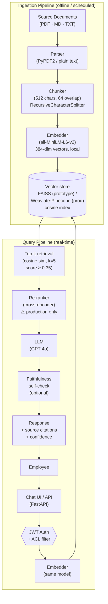
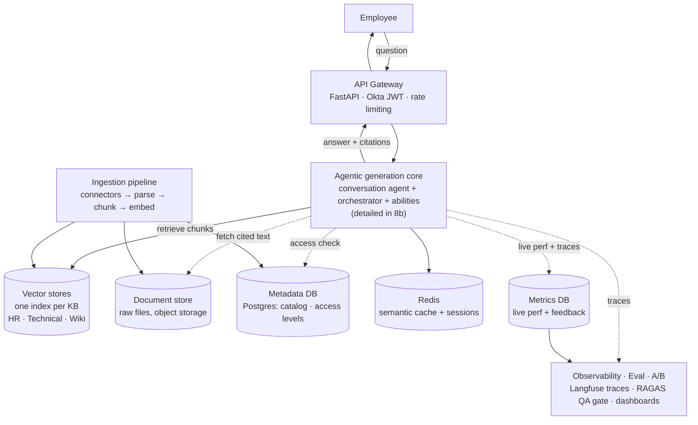
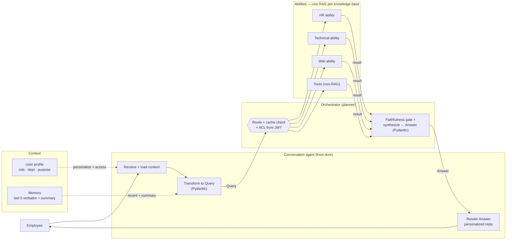

# Architecture Proposal — Corporate RAG Chatbot

> **This document presents two architectures:** the **current prototype** (implemented and running today — Sections 1–6) and the **proposed 3-month production system** (Sections 7–8). Each prototype section identifies what it does *not* implement, and why.
>
> **Diagrams are inline (Mermaid)** and render automatically on GitHub. Following the C4 convention, the system is presented at increasing levels of detail: the **prototype** flow below, then the **3-month target** at two levels — a container view and a detailed view of the agentic core (Section 8).

## Executive Summary

- **Query flow:** user → API (authentication) → embed query → vector search → (re-rank) → inject top-k chunks into prompt → LLM → answer with citations.
- **Ingestion:** documents → parse → chunk (512 chars, 64 overlap) → embed (MiniLM) → store in vector index.
- **Retrieval:** dense vector search in the prototype; hybrid (BM25 + vector) with cross-encoder re-ranking in the production design.
- **Access control (defense in depth):** a network perimeter (VPN / SSO) governs access to the application, followed by per-document metadata filtering at the **retrieval layer**. Access control is never delegated to the LLM, which is not a security boundary.
- **Multi-tenancy:** a single index with per-document `department`/`access_level` metadata filtering; separate collections are reserved for regulated isolation.
- **Prototype limitation:** FAISS (a pure vector index) has no metadata filtering, so access control requires a metadata-aware store (Weaviate/Pinecone/Chroma) in production.
- **3-month target (Section 8):** evolves the single-index, single-agent prototype into an **agentic, multi-knowledge-base** system — a conversation agent and orchestrator routing across one specialized RAG ability per knowledge base, with personalization, two-tier memory, and typed (Pydantic/JSON) outputs.

Sections 1–6 expand the points above (the current prototype). Sections 7–8 present the 3-month target.

## System Diagram



---

## 1. End-to-End Data Flow

### Query path (real-time)

1. The employee submits a question through the chat interface or REST API.
2. FastAPI validates the JWT and extracts `{user_id, department, role}` from the claims.
3. The query is embedded with the same model used at ingestion time (the query and ingestion embedding models must match).
4. The vector store receives the query vector together with a metadata filter derived from the user's claims, ensuring the user sees only documents their role permits. (The prototype uses FAISS, a pure vector index; the metadata-filter step is a production capability provided by Weaviate/Pinecone/Chroma — see Section 6.)
5. Top-k chunks are retrieved by cosine similarity. In production a cross-encoder re-ranker would rescore these; the prototype omits re-ranking to reduce dependencies.
6. Retrieved chunks are injected into a structured prompt alongside the last three turns of conversation history.
7. The LLM generates a grounded response. System-prompt instructions constrain it to the supplied context.
8. The response is returned with source citations so employees can verify the original document.

### Rationale for ordering

Retrieval must precede any LLM call. Instructing the LLM to filter out unauthorized content after retrieval is not a security boundary; the metadata filter at step 4 is.

---

## 2. Ingestion Pipeline

### Steps

| Step | Tool | Decision |
|---|---|---|
| Source crawl | Webhook / scheduled job | Triggered on document update, not polling |
| Parse | PyPDF2 (PDF), plain text (.txt/.md) | Handles the common formats; Unstructured.io would replace this in production for tables and embedded images |
| Chunk | `RecursiveCharacterTextSplitter` | 512 chars, 64 overlap |
| Embed | `sentence-transformers/all-MiniLM-L6-v2` | Local, zero per-token cost |
| Store | FAISS (prototype) / Weaviate·Pinecone (prod), cosine index | See Section 6 for namespace rationale |

### Chunking rationale

512 characters (approximately 128 tokens) is a deliberate middle ground:
- **Too small** (< 128 chars): individual chunks lose enough context that the LLM cannot form a useful answer from them.
- **Too large** (> 1,024 chars): retrieval precision declines because each chunk covers multiple topics, diluting the similarity score.

The 64-character overlap prevents a fact from being split across chunk boundaries (for example, a policy rule spanning two paragraphs).

### Prototype limitations (and rationale)

- **Incremental ingestion with change detection:** production would hash source documents and skip unchanged ones. Omitted here because the mock data does not change.
- **Table extraction from PDFs:** PyPDF2 loses table structure. Unstructured.io or Azure Document Intelligence handle this correctly but add significant setup overhead for a prototype.
- **Chunk deduplication:** if the same document is ingested twice, chunks duplicate. A content-hash check before insertion would prevent this.

---

## 3. Retrieval Strategy

### Prototype: dense vector search

- Query embedded → cosine similarity against the FAISS index → top-5 chunks above the threshold (0.35).
- Straightforward, easy to reason about, and sufficient for the proof-of-concept.

### Production: hybrid retrieval

Dense vector search alone has a known failure mode: it misses **exact keyword matches**. A query such as "what is our ITAR compliance policy?" may surface loosely related documents because "ITAR" is a rare acronym the embedding model has not seen in context.

The production design adds:

1. **BM25 keyword search** alongside vector search (sparse retrieval).
2. **Reciprocal Rank Fusion (RRF)** to merge the two ranked lists, avoiding manual weight tuning.
3. **Cross-encoder re-ranking** on the combined candidate set. A cross-encoder reads (query + chunk) together rather than comparing pre-computed vectors, which significantly improves precision at a cost of approximately 50–200 ms latency.

The prototype omits steps 2 and 3. This is a deliberate scope reduction, documented here rather than omitted silently.

---

## 4. LLM Orchestration

### Prompt structure

```
[System prompt — role, constraints, citation instruction]

Context:
[Source: hr_policy.txt]
<chunk text>
---
[Source: tech_docs.txt]
<chunk text>

Previous conversation:
User: ...
Assistant: ...

Current question: {user_query}
```

### Context management decisions

- **Maximum 5 chunks × 512 chars ≈ 2,560 chars of context** — well within any model's context window while keeping cost predictable.
- **Conversation history capped at 3 turns** (6 messages). Older turns are dropped from the prompt; retaining full history would grow the prompt unbounded and inflate per-query token cost.
- **Temperature = 0.2** — a low temperature favours factual, consistent responses and avoids creative paraphrasing of policy documents.

### Handling ambiguous or out-of-scope queries

Two layers of defence:

1. **Retrieval guard:** if no chunk scores above the similarity threshold, the system returns a predefined "not in knowledge base" message without calling the LLM. This avoids token spend and prevents hallucination.
2. **Prompt instruction:** the system prompt explicitly instructs the LLM to answer only from the supplied context, not from prior training knowledge. This is imperfect (models can be steered away from instructions), which is why layer 1 is the authoritative gate.

---

## 5. Authentication and Access Control

> Not implemented in the prototype; presented here as the production design.

### Design principle

**Access control is enforced at the retrieval layer, not the LLM layer.** A document that should not be visible to a user must never be retrieved. Instructing the LLM not to mention sensitive documents is not a security control.

### Defense in depth — three layers

Access control is not a single gate; it is layered so that a failure in one does not expose data:

1. **Network perimeter (before the application).** The chatbot is an internal tool and sits behind the corporate boundary: reachable only over the company **VPN / private network**, or a zero-trust access proxy such as Cloudflare Access or Google IAP. An external party cannot load the interface. For a fully offline/on-premise deployment, this layer also keeps the entire stack — including the LLM — inside the company network so no data leaves.
2. **Identity / authentication (to start a session).** Reaching the application requires **SSO login** (Okta / Entra ID, or **Google Workspace SSO with Identity-Aware Proxy** given the GCP environment); the gateway then issues a short-lived **JWT**. Without a valid token, no session begins. This ties every request to a verified employee identity.
3. **Document-level authorization (per query).** The JWT claims drive the **retrieval-layer metadata filter** described below, so an authenticated employee retrieves only the documents their role and clearance permit.

Layers 1–2 govern access to the application; layer 3 governs which documents a given user may see. The prototype implements none of these (it is a local demonstration), but the design assumes all three.

### Flow

```
Request → [Layer 1] must be on corporate VPN / zero-trust proxy, else blocked
       → [Layer 2] SSO login → JWT validation (FastAPI middleware)
       → decode claims: {user_id, department, role, clearance_level}
       → [Layer 3] vector-store query includes metadata filter:
           {"department": {"$in": [user.department, "all"]},
            "access_level": {"$lte": user.clearance_level}}
       → only matching chunks are candidates for retrieval
```

### Access levels (proposed)

| Level | Example | Who can see |
|---|---|---|
| `public` | company values, general onboarding | all employees |
| `department` | HR salary bands, team OKRs | department members only |
| `sensitive` | board materials, M&A documents | named roles only |

Each document is tagged with an access level at ingestion time. Tagging is a separate administrative step, not automated.

### Rationale for not relying on the LLM to filter

Prompt-injection attacks can instruct the LLM to ignore prior instructions and reveal all documents. A metadata filter at the vector-store layer cannot be bypassed in this way.

---

## 6. Multi-Tenancy and Department-Level Isolation

### Approaches considered

| Approach | Isolation | Operational cost |
|---|---|---|
| Separate collection per department | Strong — no query can cross collections | N collections to manage; cross-department queries are harder |
| Single collection with metadata filter | Weaker — the filter must not be bypassable | Simple operations; cross-department search is straightforward for administrators |

### Decision

**Metadata filtering within a single collection**, for a 500–2,000 employee company with 5–15 departments. At this scale:
- The corpus fits comfortably in a single vector-store instance.
- Cross-department search (for example, an administrator querying across HR and Legal) is valuable and straightforward.
- Filter-bypass risk is mitigated by enforcing the filter server-side and never accepting filter overrides from user input.

> **Prototype limitation:** this metadata-filter strategy requires a vector store with native metadata filtering (Weaviate, Pinecone, Chroma). The prototype uses FAISS, a pure vector index with no metadata filtering, so it stores a `department` field on each chunk but cannot enforce it at query time. Migrating to a metadata-aware store is the first step toward enabling access control.

**Separate collections** would be the appropriate choice for regulated-industry tenants (healthcare, finance) with legal isolation requirements, or for a true multi-company SaaS deployment.

### Prototype implementation

A single FAISS index named `"default"`, with a `department` metadata field stored on every chunk. The query pipeline and API accept a `department` parameter that would be supplied by the JWT in production. Because FAISS has no native metadata filtering, the prototype carries the field but does not filter on it; enforcement depends on migrating to a metadata-aware store (Weaviate/Pinecone/Chroma), identified as a production step.

---

## 7. Production Quality, Experimentation, and Rollout

> These production concerns surround the agentic core presented in Section 8 (Diagram 8a shows them in context).

This section describes how system trustworthiness is maintained in production and how the deployed version is selected.

### Observability: feedback loop and feedback table

- Every response carries a **thumbs up/down** control (implemented in the prototype via `/feedback`).
- In production, each rating is written to a **feedback table** in the metrics database with full context: `timestamp, user_id, department, query, retrieved_chunks, response, model_variant, rating, comment`.
- This table is the authoritative human-feedback signal — it powers dashboards, flags regressions, and seeds the QA golden set (a negative rating is a candidate test case).

### Automated reliability testing: QA suite of predetermined Q&A

A **golden dataset** of curated `(question, expected_answer, expected_source)` triples, built from known-good answers across HR, technical, and project-wiki topics. On every change (prompt edit, model change, reranker adjustment), a CI job runs the suite and scores automatically:
- **Retrieval:** did the expected source appear in the top-k? (context recall/precision)
- **Faithfulness:** is every claim supported by the retrieved context? (the `check_faithfulness` method, RAGAS-style)
- **Answer correctness:** does the answer match the expected one? (LLM-as-judge with string/semantic matching)

A change that drops any metric below threshold **fails the build** and does not reach users. This provides an automated, repeatable measure of answer reliability, replacing manual inspection.

### Production metrics database (live performance)

A **Postgres/warehouse** store captures live operational data per query: latency (end-to-end and per component), tokens and cost, retrieval scores, faithfulness score, cache hit/miss, model variant, and the feedback rating. This makes production performance measurable — trends over time, per-topic quality (for example, a topic scoring consistently low), cost per department, and the inputs to A/B decisions.

### A/B deployment for production experimentation

Two or more variants run side by side — for example, variant A = GPT-4o with the current prompt, variant B = GPT-4o with a reranker and a new prompt. An **A/B router** assigns each session to a variant, and results are recorded in the metrics database tagged by variant. After sufficient traffic, the variants are compared on faithfulness, positive-rating rate, latency, and cost, and the **winning variant is promoted** to default. This makes configuration selection a measured decision rather than a judgment call.

### Phased rollout — beginning with a 10-user pilot

The system is not released to all employees at once. The sequence:

1. **Pilot (10 representative users)** — a small panel spanning the departments the assistant serves (for example, HR, Engineering, Product, Operations). They use it on real questions while feedback and metrics are collected intensively and evident issues are resolved. Low exposure, high signal.
2. **A/B expansion** — access is widened and variants are compared on real traffic to select the best configuration.
3. **Graduated rollout** — access ramps to the full company once pilot and A/B metrics clear the quality and cost thresholds, with the QA suite retained as an always-on regression gate.

This staged approach contains risk — publicly documented production failures (chatbots that fabricated policies or offered invalid discounts) occurred in production, not in testing — and ensures real operations begin only after the system has proven itself on a controlled sample.

---

## 8. Target Architecture (3-Month): Agentic, Multi-Knowledge-Base

This is the **3-month target**, not the prototype. The prototype (Sections 1–6) is deliberately a single-agent, single-index RAG system; this section describes its intended evolution. Two diagrams, in C4 style: first the whole system (container view), then the agentic core (component view).

### Diagram 8a — Container view (the whole system)



### Diagram 8b — Agentic core (component view)



> Typed hand-offs at every hop — `Query` → `AbilityResult` → `Answer` (Pydantic/JSON) — enforce formatting and make hallucinations checkable (reject/retry on malformed or unsupported output). Routing and transformation use small models; synthesis uses a larger model (tiering), keeping the multi-hop cost to approximately 2.2× the single-call design.

### Rationale for the agentic design

The requirement lists **several** distinct knowledge bases — HR policies, technical documentation, project wikis. The prototype consolidates them into one index, which is acceptable for a proof-of-concept but suboptimal: an HR policy question and a database-migration question require different retrieval settings, different prompts, and different access rules.

The target instead models **each knowledge base as its own specialized RAG ability** behind an orchestrator. This allows chunking, retrieval, and prompts to be tuned per domain, access to be scoped per ability, and non-RAG abilities (for example, an on-call lookup via an API) to be added without embedding them in a monolith.

### Two-agent design

**1. Conversation Agent (the front door).** Owns the dialogue with the employee. Responsibilities:
- Receive the raw user message and hold the conversational context (user profile and history).
- **Transform the message into a structured query** — a typed `Query` object (Pydantic), not free text.
- Take the orchestrator's structured answer and **render it into a natural, personalized reply** for the user.

**2. Orchestrator Agent (the planner/router).** Does not interact with the user directly. Responsibilities:
- Receive the structured `Query`.
- **Route** to the appropriate ability or abilities (for example, HR ability, technical ability), possibly several in parallel.
- Collect the candidate answers, apply the **faithfulness/grounding gate**, and **select or synthesize** the final structured answer.
- Return a typed `Answer` object to the conversation agent.

### Abilities / skills (one RAG per knowledge base)

Each ability is a self-contained tool with a typed interface, its own retriever configuration, its own prompt, and its own access scope:

| Ability | Knowledge base / source | Type |
|---|---|---|
| HR ability | HR policy KB | RAG |
| Technical ability | Engineering docs KB | RAG |
| Project-wiki ability | Project/wiki KB | RAG |
| Directory / on-call ability | PagerDuty / HR system | non-RAG tool |
| Ticketing ability | Jira / ITSM | non-RAG action |

Adding a new domain means adding a new ability rather than reworking a monolith.

### Per-ability data pipeline: storage, chunking, retrieval

Section 2 (chunking) and Section 3 (retrieval) describe the *prototype's single* pipeline. In the agentic target, each ability owns its own, tuned to its content. This aspect, previously implicit, is made explicit here.

**Where the data lives (three stores, not one).** The data layer comprises three stores, because raw files, searchable vectors, and metadata have different requirements:

| Layer | Holds | Tech | Why separate |
|---|---|---|---|
| Document store | the raw source files (PDF, MD, HTML) and versions | object storage (S3 / GCS) | inexpensive, durable; cited text is fetched here at answer time |
| Vector store (one index per KB) | chunk embeddings and per-chunk metadata (`source`, `dept`, `access_level`) | Weaviate / Pinecone / pgvector | metadata-aware filtering enables access control; per-KB tuning |
| Metadata / relational DB | document catalog, access levels, ingestion state, versions | Postgres | drives incremental re-ingestion and access decisions |

**Chunking — tuned per domain:**

| Ability | Chunking strategy | Rationale |
|---|---|---|
| HR policies | section/heading-aware, ~512 tokens, keep a clause whole | policies are short, self-contained rules; a rule should not be split |
| Technical docs | structure-aware, larger (~800–1,000 tokens), keep code blocks and tables intact (Unstructured.io) | code and tables lose meaning when split mid-block |
| Project wikis | heading-based, medium size, prefix each chunk with the page title | wiki pages are long and multi-topic; the title disambiguates |

All use overlap to avoid boundary loss (Section 2) and are re-chunked incrementally when the source document changes (hash-based change detection).

**Retrieval — hybrid with re-ranking, per-ability configuration:**
- **Hybrid** (BM25 + dense vector, fused with RRF) — the production strategy from Section 3, applied within each ability so it can weight keyword against semantic differently (technical docs favour keyword matching for exact API/error names; HR favours semantic matching).
- **Cross-encoder re-ranking** on the merged candidates before they reach the LLM.
- **Metadata filter first** — the ACL from `UserContext` is applied at query time so out-of-scope documents are never retrieved (Section 5).
- **Per-ability `top_k` and threshold** — an ability with a small, precise KB (HR) can apply a tighter threshold than a broad one (wiki).

The orchestrator is unaware of these details; each ability exposes the same typed interface (`Query in → AbilityResult out`), so retrieval internals remain encapsulated.

### End-to-end flow

```
User message
  → Conversation Agent  (load user profile + history)
      → builds Query{intent, text, filters, user_ctx}      (Pydantic)
  → Orchestrator Agent
      → routes to ability(ies)
          → HR ability   → RAG over HR KB        → AbilityResult
          → Tech ability → RAG over Technical KB → AbilityResult
      → faithfulness gate + select / synthesize
      → Answer{text, citations, confidence, faithfulness}   (Pydantic)
  → Conversation Agent  (render, personalize)
  → user
```

This follows the **conditional/router workflow** pattern (the orchestrator routes; each ability is a tool; an evaluator/citation step completes the flow), with the conversation agent acting as a dedicated input/output transformer.

### Context system (personalization)

A typed **`UserContext`** accompanies every request: `{user_id, role, department, clearance_level, purpose}`. It serves two functions:
- **Personalization** — the same question yields a role-appropriate answer (an engineer asking about "deployment" versus someone in HR).
- **Access control** — role and clearance determine which abilities and documents are reachable (the retrieval-layer enforcement from Section 5, applied per ability).

### History management (two-tier)

To maintain continuity without unbounded token growth:
- **Short-term (verbatim):** the **last 5 messages** remain in the agent's working context.
- **Long-term (summarized):** older turns are compressed into a rolling **summary history** — a running synopsis carried in place of the full transcript.

This generalizes the prototype's rolling-window approach (Section 4): recent turns are precise, older turns summarized.

### Typed outputs (Pydantic / JSON) for formatting and hallucination control

Every hop passes a **validated, typed object** — `Query`, `AbilityResult`, `Answer` — rather than free text:
- **Formatting guarantee:** the final answer always has the same shape (text, citations, confidence, faithfulness), which the interface and downstream systems can rely on.
- **Hallucination control:** structured outputs are *checkable* — if the model returns malformed JSON, missing citations, or claims with no supporting chunk, validation **rejects and retries**. Combined with the faithfulness self-check (Section 7, already prototyped), this provides a layered guarantee of grounding and consistent formatting.

### Changes relative to the prototype (and their cost)

| Dimension | Prototype (current) | Agentic target (3-month) |
|---|---|---|
| Agents | Single RAG call | Conversation agent + orchestrator + N abilities |
| Knowledge bases | One flat FAISS index | One specialized RAG per KB |
| Storage | One index; raw text inline | Three layers: object store (files) + per-KB vector store + Postgres metadata |
| Chunking | Uniform 512/64 | Per-domain (section-aware HR, code/table-aware technical, heading-based wiki) |
| Retrieval | Dense vector, top-k + threshold | Hybrid (BM25+vector+RRF) + cross-encoder re-rank + metadata ACL, per-ability config |
| Personalization | None | `UserContext` (role/purpose) drives answer and access |
| Memory | Last-3-turn window | Last-5 verbatim + summarized long-term |
| I/O | Free text | Typed Pydantic/JSON at every hop |

The cost is non-trivial: multiple LLM hops per query increase latency and tokens (mitigated by model tiering — small models for routing/transformation, larger models for synthesis). This overhead is justified only once there are genuinely distinct knowledge bases and personalization requirements, which is why it is the **3-month** target rather than the prototype.
